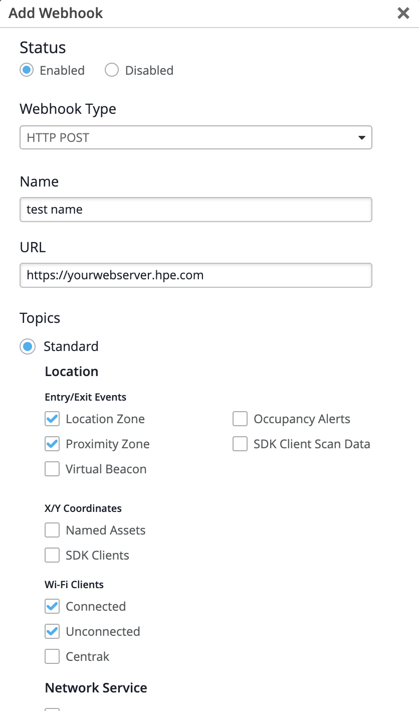

[日本語版 / Japanese: README.ja.md](README.ja.md)

# mist-location-webhook-gas

A Google Apps Script (GAS) web app that receives **Mist location webhooks** and logs each event to a Google Sheet.

It is meant for two things: **inspecting what a location payload actually contains**, and **lightweight, short-term log collection** from one or several sites. It is not a production receiver (see [Limitations](#limitations)).

```
Mist (site webhook) --HTTP POST--> Apps Script web app --append rows--> Google Sheet
```

## Supported topics

| Topic | Mist portal setting (Webhooks → Topics) |
|---|---|
| `location-client` | Wi-Fi Clients / **Connected** |
| `location-unclient` | Wi-Fi Clients / **Unconnected** |
| `location-asset` | X/Y Coordinates / **Named Assets** |
| `zone` | Entry/Exit Events / **Location Zone** or **Proximity Zone** |
| `vbeacon` | Entry/Exit Events / **Virtual Beacon** |

A single POST can carry several events in an `events` array. The script writes one row per event.

## Payload fields

The script maps the fields below to columns. The `Raw Event (JSON)` column always keeps the complete event, so you can see anything Mist sends beyond this list.

| Topic | Fields |
|---|---|
| `location-client` | `mac`, `map_id`, `rssi`, `site_id`, `timestamp`, `type`, `x`, `y` (**no IP address**) |
| `location-unclient` | Same shape as `location-client` (location of clients that are not connected to a WLAN) |
| `location-asset` | `mac`, `map_id`, `site_id`, `timestamp`, `x`, `y`, plus a name field (`name` / `device_name`) when the asset has one |
| `zone` | `zone_id`, `trigger` (enter / exit), `site_id`, `timestamp`, plus the client or asset identifier (`mac` / `id`) and `name` when present |
| `vbeacon` | `vbeacon_id`, `trigger` (enter / exit), `site_id`, `timestamp`, plus the client or asset identifier and `name` when present |

> Only the `location-client` field list has been confirmed against real payloads. For the other topics, confirm the exact fields in the `Raw Event (JSON)` column of your own sheet.

Things to know when using the data:

- **The location topics do not include an IP address.** A `location-client` event contains only `mac`, `map_id`, `rssi`, `site_id`, `timestamp`, `type`, `x` and `y`.
- **`x` / `y` are in meters**, not pixels. To draw a point on the map image, fetch the map with `GET /api/v1/sites/{site_id}/maps` and compute pixels per meter from its `width` (px) and `width_m` (m), then convert.
- **Names are not in the webhook.** `zone_id`, `vbeacon_id` and `map_id` are bare UUIDs. To show names, fetch them from the REST API and join on the ID:
  - `GET /api/v1/sites/{site_id}/zones`
  - `GET /api/v1/sites/{site_id}/vbeacons`
  - `GET /api/v1/sites/{site_id}/maps`

### Delivery interval

Mist sends location data for each client roughly **every 60 seconds**. In practice sending is thinned out, and in our measurements **an interval of about 2 minutes was more common than 60 seconds**. Do not use 60 seconds as the threshold for deciding whether a client is still present; you will get false "gone" results. Choose a threshold from your own observed intervals, with margin.

## Setup

1. **Create a spreadsheet.** Open [sheets.new](https://sheets.new/).
2. **Add the script.** In the spreadsheet, open *Extensions → Apps Script*, delete the default code and paste [`apps-script/Code.gs`](apps-script/Code.gs).
3. **Change `SHARED_KEY`.** Replace `CHANGE_ME` with a random string. Do not commit your real value anywhere public.
4. **Test.** Select `testWithDummyData` in the function dropdown and run it (approve the permissions on first run). A `MistWebhookRaw` sheet is created with a header row and one dummy row.
5. **Deploy as a web app.** *Deploy → New deployment → Web app*. Execute as: **Me**. Who has access: **Anyone** (Mist does not send Google credentials). Copy the web app URL (`https://script.google.com/macros/s/<DEPLOYMENT_ID>/exec`).
6. **Create the webhook in the Mist portal.** Create a **site-level** webhook (Organization → Site Configuration → *your site* → Webhooks), type HTTP POST. Set the Target URL to the web app URL with the key appended:

   ```
   https://script.google.com/macros/s/<DEPLOYMENT_ID>/exec?key=<SHARED_KEY>
   ```

   In the *Add Webhook* dialog, enter the Target URL and select the location topics you need (see [Supported topics](#supported-topics)). The screenshot below shows the dialog with only the topics for Wi-Fi client location enabled:

   

7. Check that rows appear in the `MistWebhookRaw` sheet.

### Choosing topics

Enable only the topics you need. Every enabled topic adds incoming requests, and each request consumes Apps Script execution-time quota.

- To watch the location of Wi-Fi devices, `Connected`, `Unconnected`, `Location Zone` and `Proximity Zone` are enough.
- Leave `Named Assets` (BLE tags) and `SDK Clients` off unless you need them.

### Multiple sites

Location webhooks are created under **Site Configuration**, not at the Organization level. To receive from several sites you need one webhook per site. The Target URL can be the same for all of them (one deployment serves every site); append `&label=` with a human-readable name to tell the sites apart:

```
https://script.google.com/macros/s/<DEPLOYMENT_ID>/exec?key=<SHARED_KEY>&label=SiteA
```

The `Site Label` column is filled from, in order: the `label` URL parameter, the `SITE_LABELS` map in `Code.gs` (`site_id` → name), then the raw `site_id`.

### Updating the code

After changing the code, use **Deploy → Manage deployments → Edit (pencil) → Version: New version → Deploy**. Do **not** choose *New deployment*: it issues a new URL, and every webhook already configured in Mist would have to be fixed.

## Sheet output

The sheet has 15 columns. Times are JST (`Asia/Tokyo`). All values below are fictional.

| Received At (JST) | Site Label | Topic | Event Index | Client Type | Client ID / MAC | Name | Trigger | Zone / vBeacon ID | Site ID | Map ID | X | Y | Event Time (JST) |
|---|---|---|---|---|---|---|---|---|---|---|---|---|---|
| 2026-10-02 16:30:01 | Site A | location-client | 0 | wifi | 001122334455 | | | | 11111111-1111-1111-1111-111111111111 | 22222222-2222-2222-2222-222222222222 | 12.34 | 56.78 | 2026-10-02 16:29:36 |
| 2026-10-02 16:30:03 | Site A | location-asset | 0 | | aabbccddeeff | Sample Tag A | | | 11111111-1111-1111-1111-111111111111 | 22222222-2222-2222-2222-222222222222 | 3.5 | 8.25 | 2026-10-02 16:30:00 |
| 2026-10-02 16:30:31 | Site A | zone | 0 | | 001122334466 | | enter | 33333333-3333-3333-3333-333333333333 | 11111111-1111-1111-1111-111111111111 | | | | 2026-10-02 16:30:30 |

The 15th column, `Raw Event (JSON)`, holds the event as received, for example:

```json
{"mac":"001122334455","map_id":"22222222-2222-2222-2222-222222222222","rssi":-60,"site_id":"11111111-1111-1111-1111-111111111111","timestamp":1790926176,"type":"wifi","x":12.34,"y":56.78}
```

Empty cells mean the payload had no such field.

## Limitations

- **No signature verification.** Apps Script cannot read request headers, so `X-Mist-Signature`-style verification is impossible. The only authentication is the shared key in the URL. Anyone who knows the URL can write rows; treat it as a secret.
- **`MAX_ROWS` stops writing, not requests.** Once the sheet reaches `MAX_ROWS` the script stops appending rows, but `doPost` is still invoked for every webhook, so it keeps consuming your Apps Script execution-time quota. **Disable the webhook in Mist as soon as you have what you need.**
- **Not for continuous operation.** Location topics send events for every client continuously. For long-running collection, run a dedicated receiver server instead.

## Files

| Path | Description |
|---|---|
| [`apps-script/Code.gs`](apps-script/Code.gs) | The Apps Script. Also contains `summarizeBySite` (row counts per site/topic), `testWithDummyData` and `resetSheet` helpers |
| [`.githooks/pre-commit`](.githooks/pre-commit) | Secret scan that blocks commits containing real-looking UUIDs, MACs, deployment URLs or tokens (`git config core.hooksPath .githooks`) |

## License

[MIT](LICENSE)
